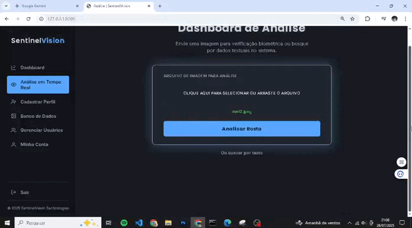

<td width="35%" valign="top">
  <a href="[LINK PARA A DEMONSTRAÇÃO ONLINE]" target="_blank">
     
  </a>
</td>
  

    <h1>Davi Anderson Batista Martins Da Silva</h1>
    <h3>Desenvolvedor Full Stack | Analista de Sistemas | Segurança da Informação</h3>
  

  

    
    <a href="mailto:davifeels333@gmail.com">
      
    </a>
    <a href="https://wa.me/5561994285138" target="_blank">
        
    </a>
  

---

### 👨‍🚀 Sobre Mim

  Desenvolvedor em formação com <strong>8 meses de experiência prática</strong> em desenvolvimento web e sistemas. Sou apaixonado por tecnologia e estou sempre em busca de evolução contínua, com foco em <strong>Python, JavaScript, Java e frameworks modernos</strong>. Tenho grande interesse em áreas como <strong>inteligência artificial, segurança da informação e reconhecimento facial</strong>, buscando sempre aplicar novos conhecimentos em projetos desafiadores.

  
  
  

---

### 💼 Experiência Profissional

  
<strong>Estagiário em Desenvolvimento de Sistemas | Instituto de Tecnologia da Informação</strong> (Fev/2025 - Atual)

  <ul>
    <li><strong>Desenvolvimento Back-End:</strong> Criação de microserviços e APIs RESTful com Java/Spring Boot e Node.js/Express, com alta cobertura de testes.</li>
    <li><strong>Segurança & Criptografia:</strong> Implementação de RSA, AES, padrões de assinatura digital (ICP-Brasil, PKI), autenticação JWT e criptografia de dados.</li>
    <li><strong>Front-End Avançado:</strong> Construção de SPAs com Angular, componentes reutilizáveis, RxJS e Angular Material.</li>
    <li><strong>DevOps & Infraestrutura:</strong> Modelagem e manutenção de bancos PostgreSQL e NoSQL, otimizando queries e melhorando a latência em 40%.</li>
    <li><strong>CI/CD & Containerização:</strong> Suporte a deploys automatizados com Docker, Kubernetes e pipelines no GitLab CI/CD.</li>
  </ul>

  
<strong>Estagiário em Administração de Banco de Dados | Instituto de Tecnologia da Informação</strong> (Set/2024 - Fev/2025)

  <ul>
    <li><strong>Automação de Processos:</strong> Desenvolvimento de scripts para ETL, carga e atualização de dados.</li>
    <li><strong>Desenvolvimento SQL Avançado:</strong> Criação de tabelas, triggers, procedures e modelagem de dados.</li>
    <li><strong>Business Intelligence:</strong> Estruturação de documentação técnica e construção de painéis de BI para análise de dados.</li>
  </ul>

---

### 🛠️ Habilidades Técnicas

<table>
  <tr>
    <td valign="top" width="50%">
      <strong>Linguagens de Programação</strong>
      

        
      

      <strong>Frameworks & Tecnologias</strong>
      

        
      

    </td>
    <td valign="top" width="50%">
      <strong>Banco de Dados</strong>
      

        
      

      <strong>Segurança & DevOps</strong>
      

        
      

    </td>
  </tr>
</table>

---

### 🚀 Projetos em Destaque

<table width="100%">
  <tr>
    <td width="65%" valign="top">
      <h3>Sistema de Vigilância</h3>
      
Sistema de monitoramento com detecção de movimento usando OpenCV, captura de vídeo via webcam e interface web simples. Desenvolvido para aprender conceitos de visão computacional.

       
      

        <strong>Tecnologias:</strong>
        
      

       
      

        
        
      

    </td>
    <td width="35%" valign="top">
      <a href="[LINK PARA A DEMONSTRAÇÃO ONLINE]" target="_blank">
         
      </a>
    </td>
  </tr>
</table>

<table width="100%">
  <tr>
    <td width="65%" valign="top">
      <h3>Projeto Sentinel - Reconhecimento Facial</h3>
      
Sistema de reconhecimento facial desenvolvido com Python e OpenCV, implementando algoritmos básicos para identificação de rostos. Inclui interface simples e armazenamento em banco de dados SQLite.

       
      

        <strong>Tecnologias:</strong>
        
      

       
      

        
        
      

    </td>
    <td width="35%" valign="top">
      <a href="[LINK PARA A DEMONSTRAÇÃO ONLINE]" target="_blank">
         
      </a>
    </td>
  </tr>
</table>

<table width="100%">
  <tr>
    <td width="100%" valign="top">
      <h3>FURIA - Know Your Fan</h3>
      
Site desenvolvido para a equipe de e-sports FURIA com formulários para coleta de dados de fãs, validação e armazenamento em banco de dados. Focado em aprender desenvolvimento web fullstack.

       
      

        <strong>Tecnologias:</strong>
        
      

       
      

        
        
      

    </td>
  </tr>
</table>

<table width="100%">
  <tr>
    <td width="100%" valign="top">
      <h3>Chatbot FURIA</h3>
      
Página web interativa com perfis dos jogadores da FURIA e chatbot simples para cada jogador, usando JavaScript básico para praticar interatividade web.

       
      

        <strong>Tecnologias:</strong>
        
      

       
      

        
        
      

    </td>
  </tr>
</table>

---

### 🎓 Formação Acadêmica

  <strong>Graduação em Banco de Dados</strong> (2º Semestre) - <i>Faculdade UniCesumar (Cursando)</i>

---

### 📊 Estatísticas do GitHub

  <a href="https://github.com/davifeels">
    
    
  </a>
  <a href="https://github.com/davifeels">
    
  </a>

